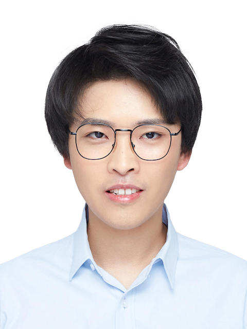

## About Me



I am currently a computer vision algorithm engineer Alibaba DAMO Academy, and my mentor is Xiuyu Sun and Dr. Ming Lin. My research interests are in machine learning and computer vision, especially in neural architecture search (NAS) and 3D vision. I just obtained my master degree in pattern recognition and intelligent system from [Beihang University](https://www.buaa.edu.cn), searching for NAS. And my supervisor is Prof. [Baochang Zhang](https://scholar.google.com/citations?user=WH0J_34AAAAJ&hl=en).

## Journal & Conference Papers

- **Hanlin Chen**, Li'an Zhuo, Baochang Zhang, Xiawu Zheng, Jianzhuang Liu, Rongrong Ji, David Doermann, Guodong Guo. [Binarized Neural Architecture Search for Efficient Object Recognition](https://arxiv.org/pdf/2009.04247.pdf). IJCV, 2021.

- **Hanlin Chen**, Baochang Zhang, Song Xue, Xuan Gong, Hong Liu, Rongrong Ji, David Doermann. [Anti-Bandit Neural Architecture Search for Model Defense](https://arxiv.org/pdf/2008.00698.pdf). ECCV, 2020. [[CODES](https://github.com/bczhangbczhang/ABanditNAS)]

- **Hanlin Chen**, Li'an Zhuo, Baochang Zhang, Xiawu Zheng, Jianzhuang Liu, David Doermann, Rongrong Ji. [Binarized Neural Architecture Search](https://arxiv.org/pdf/1911.10862v1.pdf). AAAI, 2020. [[CODES](https://github.com/bczhangbczhang/BNAS)]

- Song Xue<sup>†</sup>, **Hanlin Chen**<sup>†</sup>(co-first), Chunyu Xie, Baochang Zhang, Xuan Gong, David Doermann. [Fast and Unsupervised Neural Architecture Evolution for Visual Representation Learning](https://ieeexplore.ieee.org/document/9492168). IEEE Computational Intelligence Magazine, 2021.

- **Hanlin Chen**, Xudong Zhang, et al. Efficient Facial Landmark Localization based on Binarized Neural Networks. Electronics, 2020.

- Li'an Zhuo, Baochang Zhang, Linlin Yang, **Hanlin Chen**, Qixiang Ye, David Doermann, Rongrong Ji, Guodong Guo. [Cogradient Descent for Bilinear Optimization](https://openaccess.thecvf.com/content_CVPR_2020/papers/Zhuo_Cogradient_Descent_for_Bilinear_Optimization_CVPR_2020_paper.pdf). CVPR, 2020. [[CODES](https://github.com/bczhangbczhang/CoGD)]


- Li’an Zhuo, Baochang Zhang, **Hanlin Chen**, Linlin Yang, Chen Chen, Yanjun Zhu, David Doermann. [CP-NAS: Child-Parent Neural Achitecture Search for 1-bit CNNs](https://www.ijcai.org/proceedings/2020/0144.pdf). IJCAI 2020.

- Sheng Xu, **Hanlin Chen**, Kexin Liu, Jinhu Lii, Baochang Zhang, [Efficient Block Pruning based on kernel and feature stabilization](https://ieeexplore.ieee.org/document/8946001). Neural Computing and Applications, 2020.

- Sheng Xu, **Hanlin Chen**, Kexin Liu, Jinhu Lii, Baochang Zhang. [Efficient Block Pruning based on kernel and feature stablization](https://ieeexplore.ieee.org/document/8946001). Proceedings of Digital Image Computing: Techniques and Applications, 2019. (DICTA 2019)

- Chunlei Liu, Wenrui Ding, Yu Hu, **Hanlin Chen**, Baochang Zhang, Shuo Liu. [Guided Convolutional Network](https://www.researchgate.net/publication/336051683_Guided_Convolutional_Network). 13th International Conference on Distributed Smart Cameras. (ICDSC 2019)


## Research Experience
* **Machine Intelligence, Vision Lab (Alibaba DAMO Academy)**
  - Research on Neural Architecture Search (NAS).
  
  - Research on 3D vision


* **The Baochang Zhang’s Group (Beihang University)**
  - Research on Neural Architecture Search (NAS).

  - Research on model quantization and pruning.

  - Research on unsupervised learning.

  - Research on adversarial training.


## Education

* **Beihang University, Beijing, China**

    Master of Pattern Recognition and Intelligent System, Sep 2018 - Present

* **Shenyang Aerospace University, Shenyang, China**

    Bachelor of Aircraft Design and Engineering, Sep 2014 - Jun 2018

  <!-- |                       |               |
  |:----------------------|--------------:|
  |**Beihang University** | Beijing, China|
  |Master of Pattern Recognition and Intelligent System | Sep 2018 - Present|
  |**Shenyang Aerospace University** | Shenyang, China|
  |Bachelor of Aircraft Design and Engineering | Sep 2014 - Jun 2018| -->

## Awards

* **Excellent Graduation Thesis in Beihang University, 2021.**

* **Excellent Graduate in Beihang University, 2021**

* **National Scholarship in China, 2021.**
  
* **Liaoning Provincial Government Scholarship, 2016.**

## Skills

- **Spoken Languages**: English

- **Programming Languages**: Python, C/C++, matlab

- **Technologies and Frameworks**: Pytorch, Tensorflow, Linux

## Contact

**Institution**: Machine Intelligence, Vision Lab, Alibaba DAMO Academy, Beijing, China

<!-- **Address**: Room 1126, New Main Building #E, XueYuan Road No.37, Beihang University, 100191 -->

**E-mail**:  [hlinchen@foxmail.com](mailto:hlinchen@foxmail.com) or [hlchen1105@gmai.com](mailto:hlchen1105@gmai.com)

**Phone**: [+86-17812032728](tel:+86-17812032728)


```markdown
Syntax highlighted code block

# Header 1
## Header 2
### Header 3

- Bulleted
- List

1. Numbered
2. List

**Bold** and _Italic_ and `Code` text

[Link](url) and 
```

For more details see [GitHub Flavored Markdown](https://guides.github.com/features/mastering-markdown/).

### Jekyll Themes

Your Pages site will use the layout and styles from the Jekyll theme you have selected in your [repository settings](https://github.com/HLinChen/hlchen/settings/pages). The name of this theme is saved in the Jekyll `_config.yml` configuration file.

### Support or Contact

Having trouble with Pages? Check out our [documentation](https://docs.github.com/categories/github-pages-basics/) or [contact support](https://support.github.com/contact) and we’ll help you sort it out.
